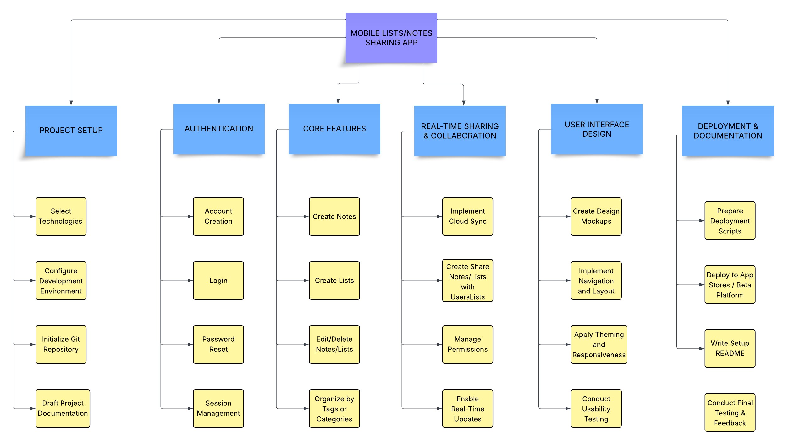

# Mobile Lists/Notes Sharing App

## 1. Introduction
**Version:** 1.0  
**Project Sponsor:** Mohammed Shaikh, Eren Kilinc, Aydin Arif  
**Project Manager:** Mohammed Shaikh  
October 10th, 2025

The Mobile Lists/Notes Sharing App Project aims to develop a mobile application that allows users to create, manage, and share lists and notes seamlessly across devices. This project supports collaborative and efficient note-taking and task management in different social or work settings. 

## 2. Overview
EDUConnect (Mohammed, Eren, Aydin) is planning to develop a cross-platform mobile application where users will create personalized lists and notes, share and collaborate with others in real-time. 

### 2.1 Objective
A mobile lists/notes sharing application designed for students, teams, and individuals will be developed and launched as a beta version by December 31st, 2025, with 5 core features including a user-friendly interface, secure authentication, reliable sharing capabilities, real-time collaboration tools, and cross-platform compatibility to address efficient shared note-taking needs in academic and professional settings.

## 3. Milestones 
1. List of technological choices for mobile platform, front-end framework, back-end, database, and hosting/deployment defined 
2. Mobile app development environment set up and basic project structure established
3. User authentication and account management system designed and tested
4. Core note/list creation and editing functionality designed and tested
5. Real-time sharing and collaboration features designed and tested

### 3.1 Work Breakdown Structure

### 3.2 Requirements Traceability Matrix (RTM)
| Req ID | Requirement                                                                 | Del ID | Deliverable                                                     | Owner                        | Status  |
|---------|------------------------------------------------------------------------------|--------|------------------------------------------------------------------|-------------------------------|----------|
| REQ01  | Define and document the mobile tech stack, frameworks, and development setup | DEL01  | Fully functional mobile app prototype with note and list creation features | Mobile Lists/Notes Sharing App | Pending |
| REQ02  | Implement secure user authentication and account management                  | DEL02  | User authentication and access control system                   | Mobile Lists/Notes Sharing App | Pending |
| REQ03  | Develop and test list and note creation, editing, and management             | DEL01  | Fully functional mobile app prototype with note and list creation features | Mobile Lists/Notes Sharing App | Pending |
| REQ04  | Enable real-time collaboration and sharing of notes/lists                    | DEL03  | Real-time sharing and collaboration functionality               | Mobile Lists/Notes Sharing App | Pending |
| REQ05  | Design an intuitive, responsive, and accessible user interface               | DEL04  | User interface design and documentation                         | Mobile Lists/Notes Sharing App | Pending |

## 4. Deliverables
1. Fully functional mobile app prototype with note and list creation features.
2. User authentication and access control system.
3. Real-time sharing and collaboration functionality.
4. User interface design and documentation.
5. Deployment scripts and README for project setup.

### 4.1 Gantt Chart

## 5. Preliminary Budget

### 5.1 Personnel Cost Per Sprint

| Role                         | Rate    | Allocation        | Sprint Cost |
|------------------------------|---------|-------------------|-------------|
| Project Manager              | $30/hr  | 3 hrs/sprint      | $90/sprint  |
| Back-End Developer           | $25/hr  | 10 hrs/sprint     | $250/sprint |
| Front-End Developer          | $25/hr  | 10 hrs/sprint     | $250/sprint |
| UI/UX & Database Designer    | $25/hr  | 10 hrs/sprint     | $250/sprint |

Each sprint is 1 week, total 8 sprints.

### 5.2 Total Personnel Cost

- Project Manager: $30/hr × 3 hrs/sprint × 8 sprints = **$720**
- Back-End Developer: $25/hr × 10 hrs/sprint × 8 sprints = **$2,000**
- Front-End Developer: $25/hr × 10 hrs/sprint × 8 sprints = **$2,000**
- UI/UX & Database Designer: $25/hr × 10 hrs/sprint × 8 sprints = **$2,000**
- **Total Personnel Cost: $6,720**

### 5.3 Fixed Costs

| Item                      | Qtd      | Cost/Item      | Total Cost     |
|---------------------------|----------|----------------|----------------|
| Expo/React Native Tools   | 1        | $150/project   | $150           |
| Firebase Hosting/DB (1 yr)| 12 months| $50/month      | $600           |
| Design Software (Figma)   | 2 months | $20/month      | $40            |
| Misc. (licenses, extras)  | Estimate | $60            | $60            |
| **Total Fixed Costs**     |          |                | **$850**       |

### 5.4 Contingency

- Calculation: 15% of personnel + fixed costs
- \(0.15 x (6720 + 850) = \$1,163 \)
- **Contingency Reserve: $1,163**

### 5.5 Total Estimated Cost

| Category      | Total Cost |
|---------------|------------|
| Personnel     | $6,720     |
| Fixed Costs   | $850       |
| Contingency   | $1,163     |
| **Grand Total** | **$8,733** |

## 6. Organization/Stakeholders

## 7. Risks, Assumptions, and Constraints
